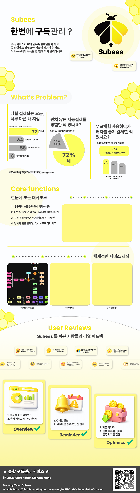
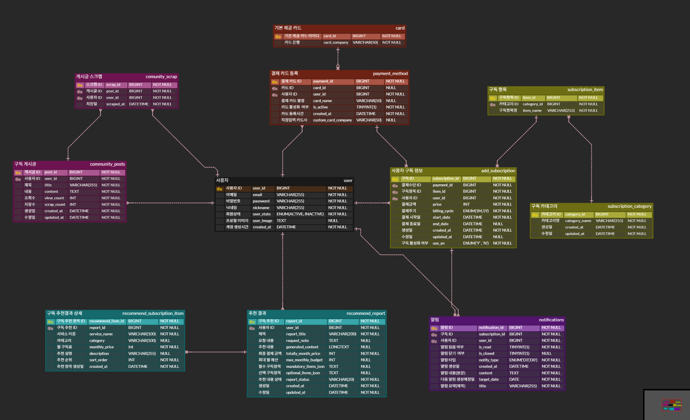
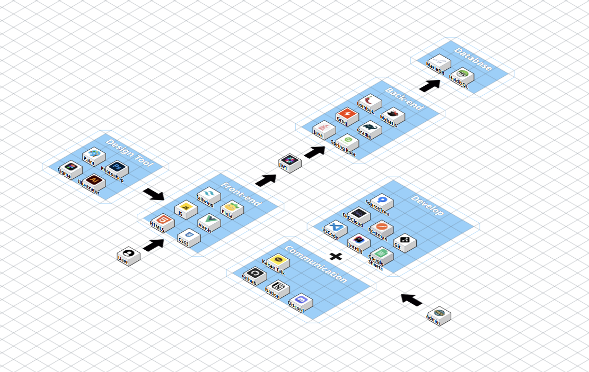

<!-- ✅ 상단 배너(Front와 동일) -->

 

<!-- ✅ 로고(Back-end는 로고 사용, 포스터 섹션은 제외) -->

<!-- ✅ 로고(Back-end는 로고 사용, 포스터 섹션은 제외) -->

  

---

## 👥 팀원 소개

<table align="center">
  <tr>
    <td align="center" width="180">
      
       
      <b>조장:김가영</b>
       
      
    </td>

  <td align="center" width="180">
      
       
      <b>김다솜</b>
       
      
    </td>

  <td align="center" width="180">
      
       
      <b>김승욱</b>
       
      
    </td>

  <td align="center" width="180">
      
       
      <b>김정수</b>
       
      
    </td>

  <td align="center" width="180">
      
       
      <b>신민수</b>
       
      
    </td>

  <td align="center" width="180">
      
       
      <b>이서윤</b>
       
      
    </td>
  </tr>
</table>

---

## 📚 [Back-end] Repository 목차
1. [📌 프로젝트 개요](#프로젝트-개요-project-overview)
2. [🎯 서비스 목표](#서비스-목표)
3. [📖 프로젝트 시나리오](#프로젝트-시나리오)
4. [🧾 요구사항 명세서](#요구사항-명세서)
5. [🗺️ ERD](#erd)
6. [📋 테이블 명세서](#테이블-명세서-및-제약-조건)
7. [🏗️ 시스템 아키텍처](#시스템-구성도)
8. [📑 API 명세서](#api-명세서)
9. [✅ 개발 산출물 및 검증 (Outputs & Validation)](#개발-산출물-및-검증-outputs--validation)
10. [📄 SQL 산출물](#sql-산출물)
11. [🧪 API 단위 테스트 결과서](#api-단위-테스트-결과서)
12. [📝 프로젝트 마무리 회고 및 향후 확장 계획](#프로젝트-마무리-회고-및-향후-확장-계획)

---

## 📌 프로젝트 개요 (Project Overview)
- **서비스 명칭:** Subees
- **서비스 소개:** Subees는 여러 플랫폼에 흩어져 있는 구독 정보를 한곳에서 통합 관리하고, 결제일·구독 금액·주기 등을 한눈에 확인할 수 있도록 돕는 통합 구독관리 서비스입니다.
- **프로젝트 목적:** 사용자가 구독 서비스로 인해 발생하는 지출 누락, 중복 결제, 무료체험 종료 후 자동 결제와 같은 문제를 줄이고, 소비 패턴 분석과 알림 기능을 통해 더 합리적인 구독 생활을 할 수 있도록 지원하는 것을 목표로 합니다.
- **주요 제공 가치:** 구독 등록 및 관리, 결제 예정 알림, 월별/카테고리별 소비 분석, 사용자 맞춤형 추천 기능을 통해 구독 피로도를 낮추고 지출 최적화를 돕습니다.

---

## 🎯 서비스 목표
- 사용자 구독 정보와 결제 데이터를 통합 관리할 수 있는 백엔드 시스템을 구축합니다.
- 결제일, 금액, 주기 등 핵심 데이터를 안정적으로 관리하여 구독 현황 조회와 소비 분석 기능을 지원합니다.
- 알림, 분석, 추천 기능에 필요한 데이터를 일관성 있게 제공하여 서비스의 확장성과 활용도를 높이는 것을 목표로 합니다.

---

## 📖 프로젝트 시나리오

  

1. 사용자는 서비스 접속 후 회원 여부에 따라 회원가입 또는 로그인 절차를 진행한다.
2. 비회원은 이용약관 동의, 회원가입, 이메일 인증을 완료한 뒤 로그인한다.
3. 로그인한 사용자는 관리자 여부에 따라 일반 사용자 기능 또는 관리자 기능으로 분기된다.
4. 일반 사용자는 메인화면에서 대시보드, 구독목록, 마이페이지, 커뮤니티, 챗봇 기능을 이용할 수 있다.
5. 대시보드에서는 월별 소비내역, 소비 차트, 카테고리 분석, 캘린더 기반 소비 조회 기능을 제공한다.
6. 구독목록에서는 구독 서비스 등록, 조회, 변경, 수정 기능을 수행한다.
7. 마이페이지에서는 프로필 정보 및 비밀번호를 수정할 수 있다.
8. 커뮤니티에서는 게시글 조회, 작성, 수정, 삭제가 가능하다.
9. 챗봇에서는 구독 관련 질의응답 및 추천 기능을 제공한다.
10. 관리자는 관리자 전용 기능을 통해 게시글 관리, 구독목록 관리, 운영 로그 확인, 버그 수정, 업데이트를 수행한다.

---

### 🧩 요구사항 명세서

<링크>https://docs.google.com/spreadsheets/d/1t28YAF3teou6grdUzRbnRs2NyKi5boFY/edit?usp=sharing&ouid=102208872170708224187&rtpof=true&sd=true

### 🗺️ ERD

#### 주요 관계
- `user` 1 : N `add_subscription`
- `user` 1 : N `payment_method`
- `user` 1 : N `notifications`
- `user` 1 : N `community_posts`
- `user` 1 : N `community_scrap`
- `user` 1 : N `recommendations`
- `card` 1 : N `payment_method`
- `payment_method` 1 : N `add_subscription`
- `subscription_category` 1 : N `subscription_item`
- `subscription_item` 1 : N `add_subscription`
- `community_posts` 1 : N `community_scrap`

### 📋 테이블 명세서 및 제약 조건(Constraints)
<링크>https://docs.google.com/spreadsheets/d/1t28YAF3teou6grdUzRbnRs2NyKi5boFY/edit?usp=sharing&ouid=102208872170708224187&rtpof=true&sd=true
### 테이블 명세서 설명
본 테이블 설계는 `user`를 중심으로 구독 관리, 결제수단 관리, 커뮤니티, 알림, 추천 기능이 연결되도록 구성하였다.

- `user`: 회원 기본 정보 관리
- `add_subscription`: 사용자 구독 정보 관리
- `subscription_item` / `subscription_category`: 구독 항목 및 카테고리 관리
- `payment_method` / `card`: 사용자 결제수단 및 카드사 정보 관리
- `community_posts` / `community_scrap`: 게시글 및 스크랩 기능 관리
- `notifications`: 결제 알림 및 상태 관리
- `recommendations`: 예산 기반 추천 결과 저장
- `setting` / `editlog`: 설정 변경 및 수정 이력 관리

주요 제약 조건으로는 이메일·닉네임의 중복 방지를 위한 `UNIQUE`, 금액 및 성별 값 검증을 위한 `CHECK`, 그리고 사용자 및 구독 관련 테이블 간 `FK` 연결을 통해 데이터 무결성을 보장하도록 설계하였다.
---

## 🏗️ 시스템 아키텍처

### 📑 API 명세서

---

### 📄 SQL 산출물 (DDL, 핵심 프로시저/트리거)
추후에 제작 예정

### 🧪 API 단위 테스트 결과서 (DB 적재 확인 및 조회 쿼리 증빙)
추후에 제작 예정

### 📝 프로젝트 마무리 회고 및 향후 확장 계획
추후에 제작 예정
